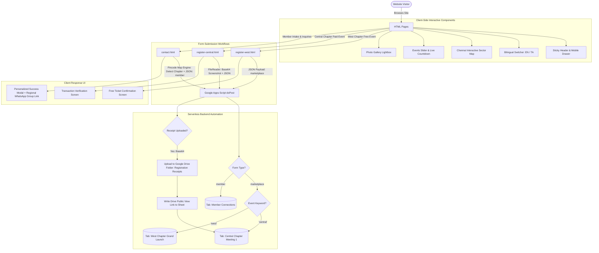
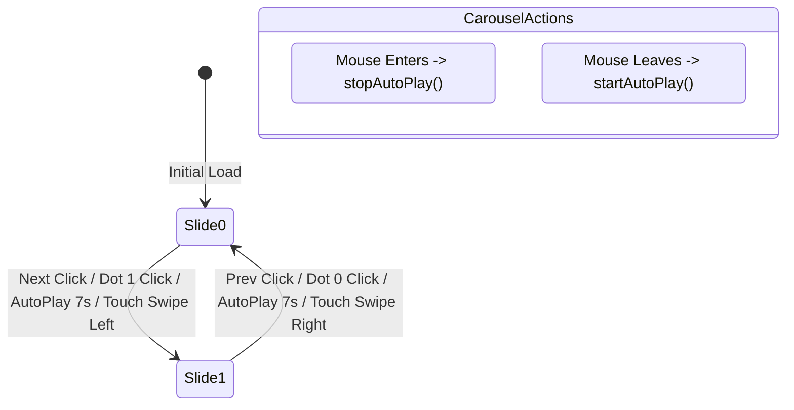
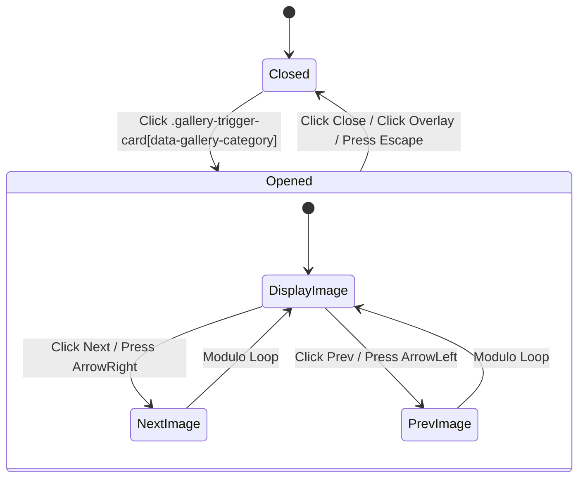
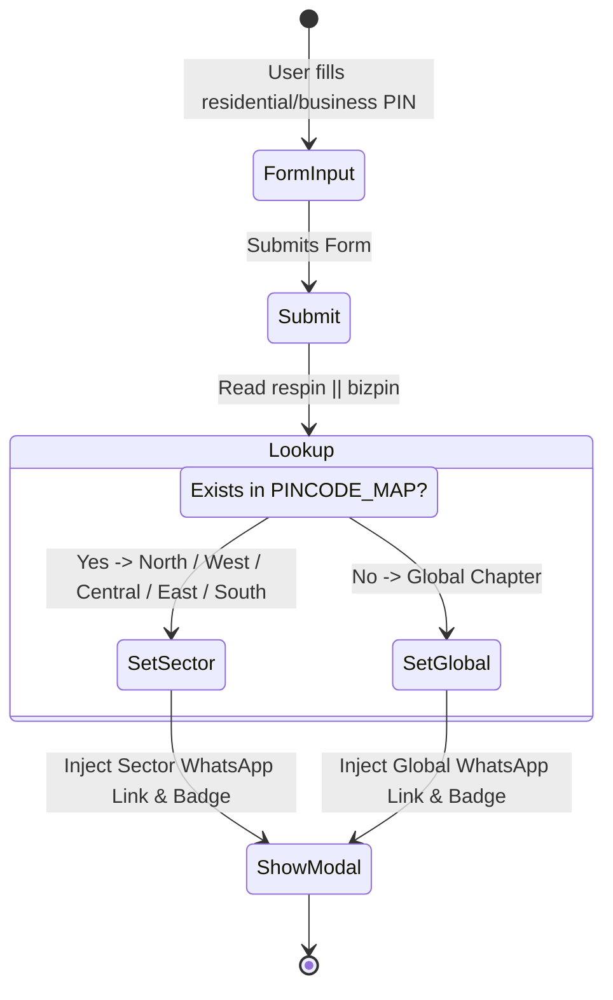

# The Kingdom Leaders (TKL) Business Hub — Architecture, Components & Flow Guide

A modern, high-performance web platform built for **The Kingdom Leaders (TKL)** organization. The platform integrates Christian leadership development, youth & civil services empowerment, kingdom business networking, regional chapter governance, and event registrations with serverless Google Workspace cloud automation.

---

## Table of Contents

1. [Technology Stack & Architecture](#technology-stack--architecture)
2. [End-to-End System Data Flow](#end-to-end-system-data-flow)
3. [Shared Global Components](#shared-global-components)
4. [Page-by-Page Component Breakdown](#page-by-page-component-breakdown)
   - [1. Home Page (`index.html`)](#1-home-page-indexhtml)
   - [2. About Us Page (`about.html`)](#2-about-us-page-abouthtml)
   - [3. Regional Chapters Page (`chapters.html`)](#3-regional-chapters-page-chaptershtml)
   - [4. Students & Youth Development (`students.html`)](#4-students--youth-development-studentshtml)
   - [5. Entrepreneurship Development (`entrepreneurship.html`)](#5-entrepreneurship-development-entrepreneurshiphtml)
   - [6. Events & Gallery (`events.html`)](#6-events--gallery-eventshtml)
   - [7. West Chapter Free Registration (`register-west.html`)](#7-west-chapter-free-registration-register-westhtml)
   - [8. Central Chapter Paid Registration (`register-central.html`)](#8-central-chapter-paid-registration-register-centralhtml)
   - [9. Contact Us & Member Intake (`contact.html`)](#9-contact-us--member-intake-contacthtml)
5. [Backend Automation Engine (`google-apps-script.js`)](#backend-automation-engine-google-apps-scriptjs)
6. [Interactive Component State Machines](#interactive-component-state-machines)
7. [Directory Structure](#directory-structure)
8. [Setup & Deployment Guide](#setup--deployment-guide)

---

## Technology Stack & Architecture

- **Frontend Core**: Semantic HTML5, Vanilla ES6 JavaScript ([script.js](file:///e:/aws-sf/kingdom%20busness%20hub/script.js))
- **Styling & Design System**: Tailwind CSS (CDN runtime), Custom Stylesheet ([styles.css](file:///e:/aws-sf/kingdom%20busness%20hub/styles.css))
- **Mapping & Geospatial**: Leaflet.js v1.9.4 + OpenStreetMap tiles
- **Animations & Micro-interactions**: AOS (Animate On Scroll) library + CSS keyframes
- **Fonts**: Google Fonts (`Plus Jakarta Sans` & `Inter`)
- **Backend & Database**: Serverless Google Apps Script Web App ([google-apps-script.js](file:///e:/aws-sf/kingdom%20busness%20hub/google-apps-script.js))
- **File & Media Storage**: Google Drive API (Base64 file receiver)
- **Database / CRM Records**: Google Sheets (Multi-tab dynamic routing)
- **External Communications**: Direct WhatsApp Community Deeplinks

---

## End-to-End System Data Flow

The platform handles three distinct submission flows routed through a single serverless Google Apps Script Web App endpoint:



---

## Shared Global Components

These components are loaded across all pages via [styles.css](file:///e:/aws-sf/kingdom%20busness%20hub/styles.css) and [script.js](file:///e:/aws-sf/kingdom%20busness%20hub/script.js).

### 1. Sticky Navigation Header (`<header id="header">`)
- **Working**: Fixed at the top (`fixed w-full z-40`). On scroll beyond 20px, `initHeaderScroll()` dynamically adds `.header-scrolled` (frosted glass background with `backdrop-filter: blur(12px)` and drop shadow).
- **Active Page Indicator**: `highlightActivePage()` checks `window.location.pathname` and adds `.nav-link-active` (blue text, gold bottom bar) to the matching desktop anchor and mobile link.
- **Desktop Dropdown Menus**: Triggered via Tailwind CSS `:hover` and JavaScript keyboard focus on `.group` containers.

### 2. Off-Canvas Mobile Drawer (`#mobile-menu-drawer` & `#mobile-menu-backdrop`)
- **Working**: Managed by `initMobileNav()`.
  - Clicking `#mobile-menu-btn` fades in `#mobile-menu-backdrop` and applies `translate-x-0` to slide the menu in from the left.
  - Body scrolling is locked with `drawer-open`.
  - Closing occurs when clicking `#mobile-menu-close-btn`, clicking the backdrop, pressing `Escape`, or selecting an internal anchor link.
- **Mobile Accordion Submenus**: Interactive buttons with class `.mobile-dropdown-btn` toggle visibility of sub-items and rotate the indicator plus/arrow by 45°/180°.

### 3. Floating Back-to-Top Button (`#back-to-top`)
- **Working**: Dynamically created by `initBackToTop()`.
- **Trigger**: Hidden by default; when the page scrolls down past 400px, it toggles from `hidden` to `flex`. Clicking it triggers smooth scrolling back to coordinate `top: 0`.

### 4. Smooth Anchor Scrolling (`initSmoothScroll()`)
- **Working**: Intercepts all `<a href="#...">` clicks, computes the element position minus the dynamic header clearance (`header.offsetHeight + 16px`), and performs a native `window.scrollTo({ behavior: 'smooth' })`.

### 5. Scroll Animations (`AOS.init()`)
- **Working**: Initialized with duration 800ms, offset 50px, and single execution (`once: true`) for smooth reveal effects as sections enter the viewport.

---

## Page-by-Page Component Breakdown

---

### 1. Home Page ([index.html](file:///e:/aws-sf/kingdom%20busness%20hub/index.html))

The main landing portal for The Kingdom Leaders, delivering organization highlights, values, leadership, and entry points.

| Component | Selector / ID | How It Works |
|---|---|---|
| **Hero Banner** | `<section id="home">` | High-impact visual banner with animated typography, mission badge, primary CTA button (*"Explore Our Events"*) and secondary CTA (*"Our Vision"*). |
| **Bilingual Vision & Mission Switcher** | `#vision-lang-en`, `#vision-lang-ta` | Managed by `initVisionMissionLangToggle()`. Clicking English displays `.vision-en` and `.mission-en` while hiding Tamil `.vision-ta` and `.mission-ta`. Clicking Tamil inverts the visibility and updates button active pill states. |
| **Core Purpose & Three Pillars** | `<section id="core-purpose">` | Interactive card grid breaking down TKL's three operational pillars: **Students & Youth Development**, **Entrepreneurship & Marketplace**, and **Leadership Development**. |
| **Recent Highlights Carousel Preview** | Section with slider cards | Visual showcase linking visitors directly to recent event photo albums and activities. |
| **Founder & President Profile** | Card containing Pastor K. Joshua Stephen's profile | Biographical section showcasing the organizational mandate, spiritual backing, and visionary message. |
| **Chennai Regional Network Teaser** | Regional hub cards | Quick overview of the 5 Chennai geographic chapters with links to [chapters.html](file:///e:/aws-sf/kingdom%20busness%20hub/chapters.html). |
| **Newsletter / Community CTA** | Footer subscription card | Lead capture component inviting visitors to join local chapter meetings. |

---

### 2. About Us Page ([about.html](file:///e:/aws-sf/kingdom%20busness%20hub/about.html))

Dedicated narrative on the founding principles, history, organizational structure, and leadership board.

| Component | Selector / ID | How It Works |
|---|---|---|
| **About Hero Header** | Top banner section | Context header establishing identity as a marketplace ministry and leadership academy. |
| **Foundational Scripture & Mandate** | Scripture spotlight box | Biblical foundation framing kingdom leadership in commerce and civil service. |
| **Organizational History & Milestones** | Interactive chronological timeline | Step-by-step visual progression showing the establishment and growth of TKL chapters. |
| **Governing & Advisory Board** | Leader card grid | High-resolution executive profiles displaying names, roles, and advisory responsibilities. |
| **Core Values Hexagon / Grid** | Card grid with icon badges | Interactive hover cards detailing Excellence, Integrity, Stewardship, and Kingdom Impact. |

---

### 3. Regional Chapters Page ([chapters.html](file:///e:/aws-sf/kingdom%20busness%20hub/chapters.html))

Interactive regional command center for the 5 Chennai operating chapters.

| Component | Selector / ID | How It Works |
|---|---|---|
| **Leaflet Geospatial Map** | `<div id="map">` | Powered by `initChennaiMap()`. Uses Leaflet.js to render an OpenStreetMap instance centered at `[13.02, 80.22]` (Chennai). Renders 5 custom sector coordinates with 6km radius circles representing chapter zones. |
| **Sector Selection Pills** | `window.selectSector(key)` | Interactive buttons for **South**, **West**, **Central**, **North**, and **East**. Clicking updates map center zoom and fires `updateDetails(sectorKey)`. |
| **Dynamic Region Details Card** | `#region-details-card` | Updates in real time when any sector button, map circle, or map marker is hovered or clicked. Dynamically populates: sector title, hub location, President photo & phone, Secretary photo & phone, and Treasurer photo & phone. |
| **Leadership Fallback Generator** | `getInitials(name)` / `renderLeader()` | If a photo is absent or the position is open, automatically renders an initial-letter avatar badge or a styled *"Position Open"* placeholder. |
| **Direct Call Links** | `<a href="tel:+91...">` | Embedded phone links allow mobile users to directly call chapter coordinators with a single tap. |
| **Chapter Meetings Schedule** | Meeting calendar grid | Shows recurring monthly schedules, meeting days, and physical venues for each sector. |

---

### 4. Students & Youth Development ([students.html](file:///e:/aws-sf/kingdom%20busness%20hub/students.html))

Dedicated to student leadership, coaching, and civil services guidance.

| Component | Selector / ID | How It Works |
|---|---|---|
| **Civil Services Coaching Focus** | Feature highlight grid | Comprehensive details on IAS/IPS/UPSC examination coaching, mentoring sessions, and study material assistance. |
| **Civic & Political Awareness** | Section cards with badges | Youth workshops on governance, public policy, and active citizen participation. |
| **Skill Acceleration Tracks** | Curriculum card matrix | Modules for communication, critical thinking, public speaking, and ethical leadership. |
| **Student Testimonials** | Quote cards | Firsthand stories from students who attended previous awareness seminars. |

---

### 5. Entrepreneurship Development ([entrepreneurship.html](file:///e:/aws-sf/kingdom%20busness%20hub/entrepreneurship.html))

Business mentoring, Kingdom marketplace ethos, and entrepreneurial networking hub.

| Component | Selector / ID | How It Works |
|---|---|---|
| **Marketplace Incubation Cycle** | Flow step cards (1 to 4) | Illustrates the step-by-step business journey: Ideation $\rightarrow$ Validation $\rightarrow$ Mentorship $\rightarrow$ Funding / Growth. |
| **B2B Networking Masterminds** | Information cards | Outlines monthly mastermind meetups, cross-referral networks, and business pitch clinics. |
| **Kingdom Business Ethics** | Principle spotlight | Focuses on honest commerce, employee welfare, tithes, and market stewardship. |
| **Directory Join Callout** | CTA action box | Direct link for registered Christian entrepreneurs to apply for chapter networking rosters. |

---

### 6. Events & Gallery ([events.html](file:///e:/aws-sf/kingdom%20busness%20hub/events.html))

Central hub for current gatherings, schedule updates, past event logs, and historical photo galleries.

| Component | Selector / ID | How It Works |
|---|---|---|
| **Upcoming Schedule & Planning Notice** | Status notice banner | Informs visitors that September 2026 launches have concluded and highlights next cohort planning with direct community WhatsApp link. |
| **Interactive Events Carousel** | `#events-carousel-track`, `#events-carousel` | Powered by `initEventsCarousel()`. Horizontal slide track highlighting concluded launches (West Chapter Launch, Central Chapter Meeting 1) with direct links to past recaps. |
| **Carousel Slide Tab Pills** | `.event-tab-btn` | Interactive tabs above the slider that switch active slides and display concluded event badges. |
| **Carousel Dot Indicators** | `#events-carousel-dots .event-dot` | Pill-shaped dot indicators tracking current slide index with active transition animations. |
| **Touch Swipe Support** | `touchstart`, `touchend` | Swipe gestures on mobile devices measure `touchStartX` and `touchEndX` (40px threshold) to advance or reverse slides. |
| **Auto-Play Engine** | `startAutoPlay()`, `stopAutoPlay()` | Automatically advances slides every 7 seconds; pauses on desktop hover (`mouseenter`) and resumes on mouse leave (`mouseleave`). |
| **Past Events Log & Recaps** | `#past` card grid | Detailed history grid featuring recently concluded events including West Chapter Grand Launch (18 Sep 2026), Central Chapter Meeting 1 (18 Sep 2026), East Chapter Launch (11 Sep 2026), and South Chapter Meeting 2 (04 Sep 2026). |
| **Photo Gallery Card Triggers** | `.gallery-trigger-card` | Clickable album cards with `data-gallery-category`: `leadersmeet-2026`, `civil-awareness`, `leadersmeet-2025`. |
| **Gallery Lightbox Modal** | `#gallery-lightbox` | Powered by `initGalleryLightbox()`. Opens an animated full-screen modal showing the active album image, counter (`1 / 8`), and title. |
| **Lightbox Keyboard & Button Navigation** | `#lightbox-prev`, `#lightbox-next`, Keyboard events | Navigate images using arrow buttons or keyboard `ArrowLeft` / `ArrowRight`. Close using `#lightbox-close`, clicking the backdrop overlay, or pressing `Escape`. |

---

### 7. West Chapter Registration ([register-west.html](file:///e:/aws-sf/kingdom%20busness%20hub/register-west.html))

Event landing page for the **West Chapter Grand Launch** (Held on 18 Sep 2026).

| Component | Selector / ID | How It Works |
|---|---|---|
| **Event Summary Header & Badges** | Luxury dark gradient hero card | Displays Date (*Friday, 18 Sept 2026*), Time (*05:30 PM*), Venue (*Praise Evangelical Church, Mugalivakkam*), and *"Free Entry (Dinner Included)"* badge. |
| **Registrations Closed Alert Banner** | Banner in `#register-form-wrapper` | Alerts visitors that the event successfully took place on 18 Sep 2026 and provides instant buttons to join the WhatsApp community or review past logs. |
| **Archived Registration Form** | `#marketplace-reg-form` | Displays form structure in an inactive/closed state with disabled submission button (*"Registrations Closed (Event Concluded)"*). |
| **Instant Confirmation View** | `#register-success-wrapper` | Displays digital pass summary template with Google Maps directions link. |

---

### 8. Central Chapter Registration ([register-central.html](file:///e:/aws-sf/kingdom%20busness%20hub/register-central.html))

Event landing and payment verification page for **Central Chapter Meeting 1** (Held on 18 Sep 2026).

| Component | Selector / ID | How It Works |
|---|---|---|
| **Event Summary Header & Badges** | Luxury dark gradient hero card | Displays Date (*Friday, 18 Sept 2026*), Venue, and Chief Guest details. |
| **Registrations Closed Alert Banner** | Banner in `#register-form-wrapper` | Alerts visitors that the meeting has concluded and provides links to the regional WhatsApp group and past recaps. |
| **Payment UPI Display & QR Code** | UPI Payment Card | Displays official UPI ID and scanning instructions. |
| **Archived Registration Form** | `#marketplace-reg-form` | Displays fields with disabled submission button (*"Registrations Closed (Event Concluded)"*). |
| **Transaction Success State** | `#register-success-wrapper` | Renders a personalized ticket pass with confirmation badge and dinner voucher verification details. |

---

### 9. Contact Us & Member Intake ([contact.html](file:///e:/aws-sf/kingdom%20busness%20hub/contact.html))

Comprehensive intake application form for new members, prayer team volunteers, and ministry inquiries.

| Component | Selector / ID | How It Works |
|---|---|---|
| **Member Intake Form** | `#contact-form` | Collects 12 comprehensive fields: Full Name, Phone, Gender, Church, Business Name, Business PIN, Business Address, Residential Address, Residential PIN, Referral, Leadership Willingness, and Prayer Team interest. |
| **Pincode Mapping Engine** | `PINCODE_MAP` (lines 523–549) | Internal database mapping over 60 Chennai postal PIN codes to specific geographic sectors (**North**, **West**, **Central**, **East**, **South**). |
| **Dynamic Regional WhatsApp Routing** | `CHAPTERS` dictionary & `showSuccessUI()` | Upon submission, inspects Residential PIN (or Business PIN fallback) against `PINCODE_MAP`. Automatically selects the correct regional chapter group link and badge (`CHAPTERS[detectedRegion]`). Fallbacks to "Global Chapter" if outside Chennai. |
| **Confirmation Modal & Direct Community Join** | `#contact-success-modal`, `#modal-join-btn` | Animated popup modal thanking the member by name, displaying their designated chapter badge, and providing an instant button: *"Join [Sector] Chapter WhatsApp Group"*. |
| **Official Headquarters Card** | Physical office address & social links | Displays official email (`founder@thekingdomleaders.in`), phone, and social media handles. |

---

## Backend Automation Engine (`google-apps-script.js`)

The backend script runs serverless inside Google Workspace infrastructure as an executable Web App.

```text
Incoming POST (JSON)
        │
        ▼
   doPost(e)
        │
   ┌────┴────────────────────────┐
   │                             │
formType === 'marketplace'   formType === 'member'
   │                             │
   ├─ Checks Event Name Keyword  └─ Appends to 'Member Connections'
   │   ├── 'central' ──► Tab: 'Central Chapter Meeting 1'
   │   └── 'west'    ──► Tab: 'West Chapter Grand Launch'
   │
   ├─ Checks for Base64 Receipt
   │   └── uploadToDrive() ──► Uploads to Drive Folder 'Registration Receipts'
   │                             └── Generates Public View Link
   │
   └─ Appends Complete Row to Active Sheet Tab
```

### Key Functions

1. **`doPost(e)`**:
   - Parses incoming JSON payload from `e.postData.contents`.
   - Distinguishes between `marketplace` (event registrations) and `member` (contact intake).
   - Dynamically checks if target sheet tab exists; creates tab and headers if not.
   - Enforces stylized headers (Warm Gold for Central, Warm Orange for West, Soft Blue for Member Connections).
   - Freezes top row for spreadsheet readability.

2. **`uploadToDrive(base64Data, mimeType, filename, participantName)`**:
   - Decodes Base64 string into binary blob (`Utilities.base64Decode`).
   - Queries or creates the target Google Drive folder: `"Registration Receipts"`.
   - Saves file with prefix: `[ParticipantName]_[Filename]`.
   - Sets file permission to `DriveApp.Access.ANYONE_WITH_LINK, DriveApp.Permission.VIEW`.
   - Returns the direct URL, which is written to column 13 of the spreadsheet.

3. **`doGet(e)`**:
   - Health check endpoint returning a plain text readiness confirmation for deployment testing.

---

## Interactive Component State Machines

### 1. Events Carousel State Machine



### 2. Gallery Lightbox State Machine



### 3. Contact Pincode Auto-Routing State Machine



---

## Directory Structure

```text
kingdom-business-hub/
├── index.html                   # Home Page (Hero, Vision/Mission EN/TA, Core Purpose)
├── about.html                   # About Page (Biblical Mandate, Timeline, Leadership Board)
├── chapters.html                # Regional Hubs (Leaflet Interactive Map & Leader Directory)
├── students.html                # Students & Youth (Civil Services & Civic Awareness)
├── entrepreneurship.html        # Entrepreneurship (Incubation, Networking, Masterminds)
├── events.html                  # Events & Gallery (Countdown, Carousel, Lightbox)
├── register-west.html           # West Chapter Grand Launch Registration (Free Entry)
├── register-central.html        # Central Chapter Meeting 1 Registration (Paid + Receipt Upload)
├── contact.html                 # Contact Us & Member Intake (Pincode Smart Routing)
├── styles.css                   # Master CSS (Glassmorphism, animations, custom scrollbars)
├── script.js                    # Master JavaScript (Nav, Leaflet, Carousel, Lightbox, Timers)
├── google-apps-script.js        # Serverless Web App Backend (Sheets router & Drive upload)
├── sitemap.xml                  # SEO Sitemap
├── robots.txt                   # Search Engine Crawler Directives
├── images/                      # Optimized image assets & photo albums
│   ├── chapter learder images/  # Regional President, Secretary, Treasurer portraits
│   ├── leadersmeet 20.6.2026/   # Photo album assets
│   ├── leaders meet 19.12.2025/ # Photo album assets
│   └── Civil awarness/          # Photo album assets
└── README.md                    # This master documentation file
```

---

## Setup & Deployment Guide

### Local Development

No build step or Node package installation is required. Run any static server inside the directory:

```bash
# Using Python
python -m http.server 8000

# Using Node / npx
npx serve .

# Using VS Code
# Install 'Live Server' extension and click 'Go Live'
```

### Connecting Google Apps Script Backend

1. Open [Google Sheets](https://sheets.new) and create a new spreadsheet.
2. In the menu, go to **Extensions** $\rightarrow$ **Apps Script**.
3. Copy all code from [google-apps-script.js](file:///e:/aws-sf/kingdom%20busness%20hub/google-apps-script.js) and paste it into the script editor.
4. Click **Deploy** $\rightarrow$ **New deployment**.
5. Select type: **Web app**.
   - **Execute as**: *Me*
   - **Who has access**: *Anyone* (mandatory for anonymous registration submissions)
6. Click **Deploy** and authorize permissions.
7. Copy the generated **Web App URL** (e.g. `https://script.google.com/macros/s/.../exec`).
8. Update `APPS_SCRIPT_URL` in the following files:
   - [register-west.html](file:///e:/aws-sf/kingdom%20busness%20hub/register-west.html#L966)
   - [register-central.html](file:///e:/aws-sf/kingdom%20busness%20hub/register-central.html#L1065)
   - [contact.html](file:///e:/aws-sf/kingdom%20busness%20hub/contact.html#L520)

---

## Support & Inquiries

- **Official Email**: `founder@thekingdomleaders.in`
- **Location**: Chennai, Tamil Nadu, India
- **Platform**: The Kingdom Leaders (TKL) Community Hub
